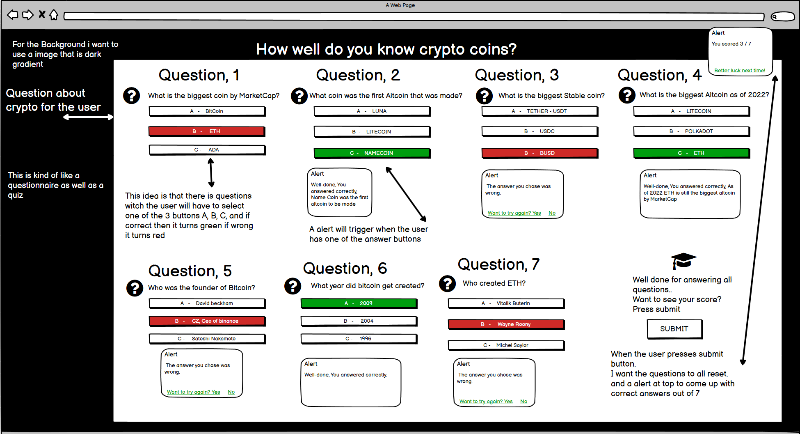

# How well do you know Crypto?

How well do you know crypto is a questionaire / quiz game for crypto enthusists who want to test there basic knowladge on crypto realaed topics.  
This sites aim is is to be a fully responsove site, That interacts with the user by either alarting them if there answer was right or by changing the color of the buttons. 
The target audiance for this site is anyone who knows about crypto as the questions asked are not that hard.
The end goal for the user is to see if they need to go and learn anything bassed on incorrect answers. 
This provides value for the user and keeps them intrested as they work throh the questions.
 
  
When designing this project i had in mind a very simple looking site. For the actual WireFrame / mockup i used <a href="https://balsamiq.com/">Balsamiq Wireframes.</a> 
want to see the mockup? Here it is.

# Features.
## index.html header - This is the main header text "How well do you know crypto?" 
* This header text's aim is to ask the user a question that they answer in there head. It sets a challange for the user and makes the site more personal.

## Background Color/Image.
* The body background is a black to gray gradiant image i took from google, This gives the site a serious feeling asweel as a cool color sqheme.

## Six Questions.
* The six questions i used are some of the basic things a beginer should know, These questions are made to seem easy for the user but puts them to the test when they have to answer them.

## Question Answers.
* The question answers are a simple mutichoice A,B or C buttons. The aim was to make these answers chnage color and alert the user of if they were correct or not, Witha  red or green color displaying over the answer they picked.

## Submit button
* This buttion is placed at the bottom of the screen, Once the user has completed the questions they can get there score via an alert once clicking the submit buttion.

# Features left to implement.
* Unfortanly due to personal time issues, I didnt have enoghe time to add any interactive features. I Hope i get the opertaunity to redo this project to the standard i wanted.

* I would also like to implement a mini snakes and ladders game on a secand page but replace the snakes and ladders with crypto coins.

# Lighthouse Report
* On the index.html page i clicked inspect element then pressed lighthouse in the top right corner. This genarates a report. Here that is...

#
# Deployment
* Before the website was deployed,
I had to use a temporary site ( Http.server ) to see the live changes while coding, To do this I used the ( Python3 -m http.server ) command in GitPod and that allowed me to see a live preview of my site while coding.

* The project was deployed on GitHub Pages.
I used Gitpod as a development environment where I then committed all changes to github, I used (Git commit -m "" ) then (Git push) command in Gitpod to save changes to GitHub.

* Once my site was ready to deploy online, I had to:
Log in to GitHub and click on repository to deploy (How-Well-Do-You-Know-Crypto) select Settings and find GitHub Pages section at the very bottom of the page from source select none and then change the branch from "none" to "main" then once that was done, I clicked save and the site was deployed after a refresh of the page.
#

View the live site <a href="">Here</a>