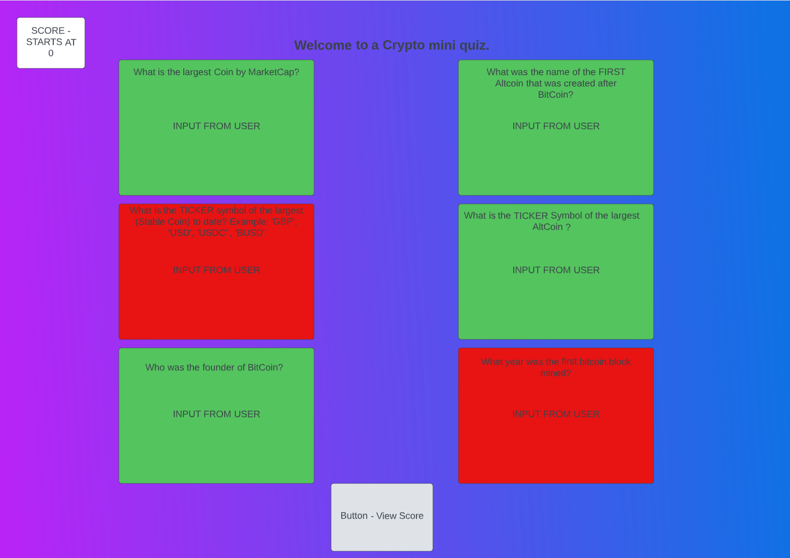
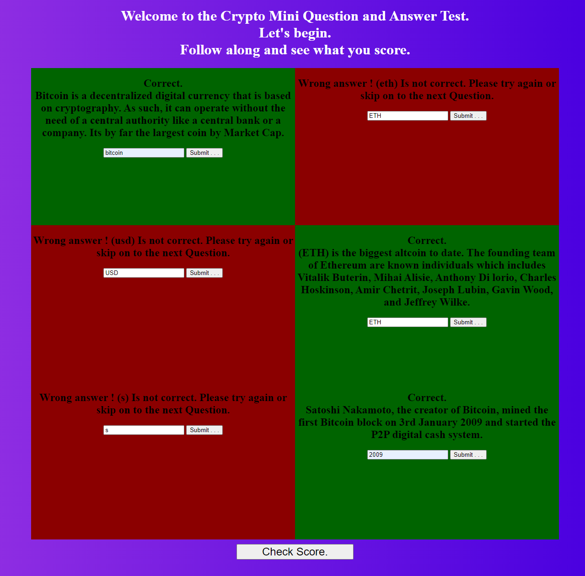
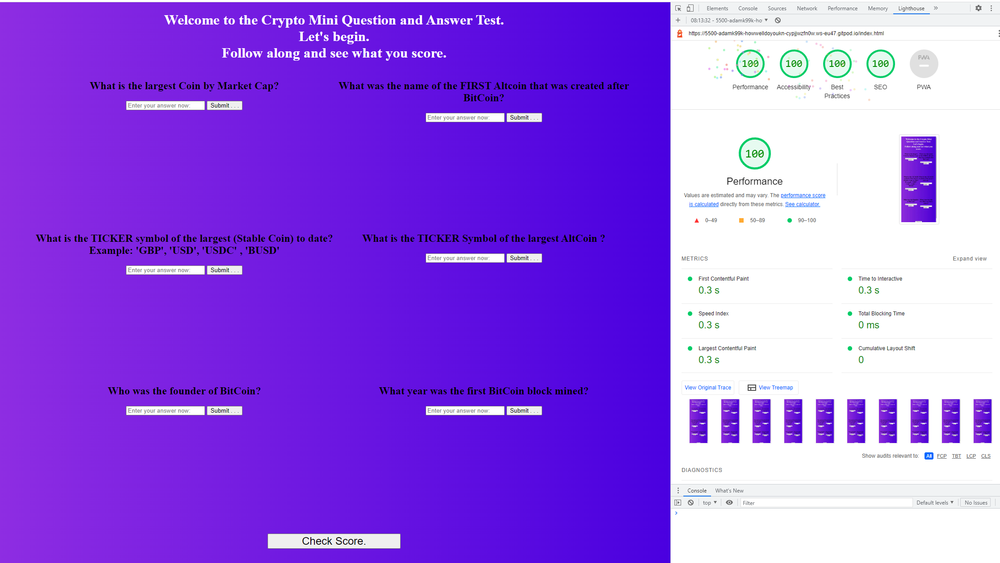

# How well do you know Crypto?

How well do you know crypto is a questionnaire / quiz game for crypto enthusiasts who want to test there basic knowledge on crypto related topics.  
This sites aim is to be a fully responsive site, That interacts with the user by alerting them if there answer was right by changing the color of the space around the input field. 
The target audience for this site is anyone who knows about crypto as the questions asked are not that hard.
The end goal for the user is to see if they need to go and learn anything based on incorrect answers. 
This provides value for the user and keeps them interested as they work through the questions.
 
  
When designing this project I had in mind a very simple looking site. For the actual Mockup I used <a href="https://www.lucidchart.com/pages/">Lucid Chart</a> 
want to see the mockup? Here it is. 
View the live site <a href="https://adamk99k.github.io/How-well-do-you-know-crypto/">Here</a>

## Lucid Chart MockUp.

# Features.
## index.html header - "Welcome to the Crypto Mini Question and Answer Test" 
* This header text's aim is to welcome the user and get straight into the Questions without overwhelming the user.

## Background Color/Image.
* The body background is a Purple/Blue linear-gradient(to right, #8e2de2, #4a00e0);

## Six Questions.
* The six questions I used are some of the basic things a beginner should know, These questions are made to seem easy for the user but puts them to the test when they have to answer them.

## Question Answers.
* The questions answers are simple, Once the user has entered their answer in the input field, A onClick function is triggered for each input field, This function will do tasks depending on what the user has entered.

## Submit button
* This button is placed at the bottom of the screen, Once the user has completed the questions they can get there score, Once this button has been clicked it sets the container for the questions, Display to 'none'. This will allow me to use the page as if it has nothing on. 

## Infomation when user gets correct answer...
* When the user enters the correct answer, Not only will the color of the box change color, but a short, Helpful text block of information appears to educate the user further.

## Pictures of deployed project.

## Here is the score page where the user will get their score with some complementary fun facts. This engages the user further before leaving the site.

# Features left to implement.
* One of the features I didn't get a chance to implement is. A function that only allows the user to try an input field a maximum number of times of (3). This would give some urgency to the user and prevent them from having unlimited tries.

* The main thing I could not implement was a section dedicated to One question at a time, Meaning once the user has submitted the first question only then will the new question appear. I couldn't do this efficiently for all of my questions so I didn't implement this feature.

# Lighthouse Report
* When testing my app via LightHouse the only issue I had to correct was my HTML document not having a meta description. Once I resolved this and retested my app. There were no issues shown.

#
# Deployment
* Before the website was deployed,
I had to use a temporary site ( Http.server ) to see the live changes while coding, To do this I used the ( Python3 -m http.server ) command in GitPod and that allowed me to see a live preview of my site while coding.

* I later installed an extension named 'Live viewer' this hosted a local instant preview of my code, Making it a more comfortable environment.

* The project was deployed on GitHub Pages.
I used Gitpod as a development environment where I then committed all changes to github, I used (Git commit -m "" ) then (Git push) command in Gitpod to save changes to GitHub.

* Once my site was ready to deploy online, I had to:
Log in to GitHub and click on repository to deploy (How-Well-Do-You-Know-Crypto) select Settings and find GitHub Pages section at the very bottom of the page from source select none and then change the branch from "none" to "main" then once that was done, I clicked save and the site was deployed after a refresh of the page.
#

View the live site <a href="https://adamk99k.github.io/How-well-do-you-know-crypto/">Here</a>

# TESTING BROWSERS.
* To test if my site works on different browsers I copy and pasted the live site link into. Google.Chrome/Firefox/Brave/WindowsExplorer And the site loaded without issue on all browsers.

# CREDITS 
* Thanks to the amazing slack community for helping me when I needed it.
* Thanks to code institute for providing me the learning material.

